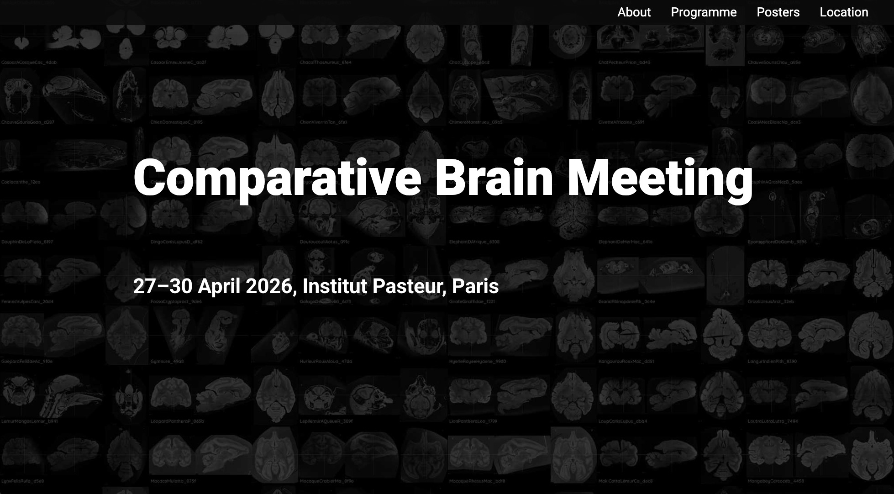

# Comparative Brain Meeting

A meeting that aims at stimulating exchanges on brain evolution, its organisation, and development and comparative analyses across the tree of life.   
27–30 April 2026, Institut Pasteur, Paris

Come join us at [https://BrainTrees.github.io/ComparativeBrainMeeting](https://BrainTrees.github.io/ComparativeBrainMeeting).

